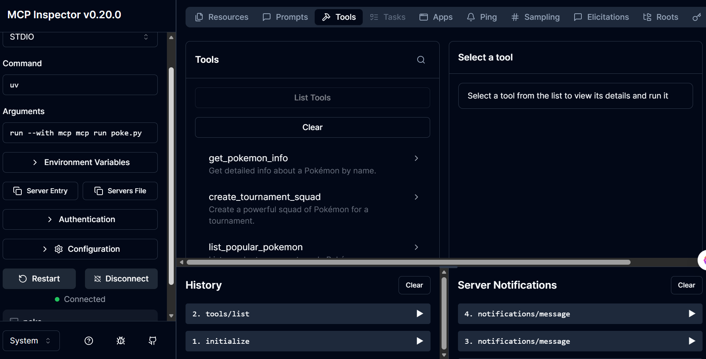
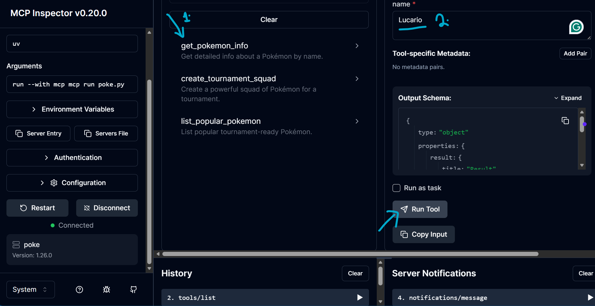
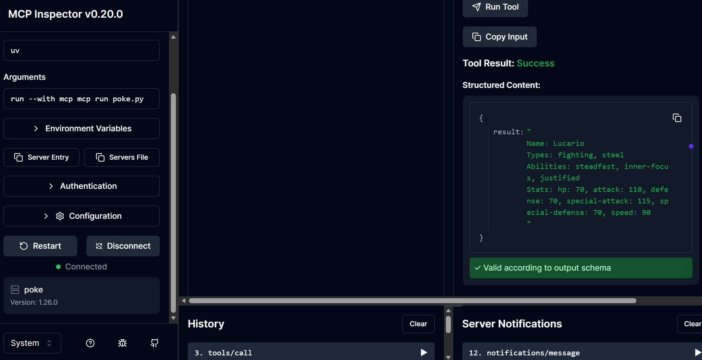

#  Pokémon MCP Server (FastMCP Implementation)

This project is a simple  high-performance Model Context Protocol (MCP) server that acts as a bridge between Large Language Models (LLMs) and the PokéAPI. By using this MCP server, an AI agent (like Claude Desktop) gains the "ability" to browse the Pokémon universe in real-time.

It uses the [FastMCP](https://github.com/chain-ml/model-context-protocol) library and `httpx` to fetch live Pokémon info via a standardized protocol that works seamlessly with LLMs and AI agents.

## 🚀 Features & Capabilities

 #### 1. Real-Time Data Fetching (get_pokemon_info).

 #### 2. Algorithmic Squad Building (create_tournament_squad).

 #### 3. Contextual Knowledge (list_popular_pokemon).

## 📦 Technical Stack/ Requirements

- Python 3.8+
- Node.js (for some LLM hosts that require it)
- `httpx`
- `mcp` (Model Context Protocol library)


## ⚙️ Installation & Setup

### Option 1: Standard Method (pip)

    Use this if you prefer the traditional Python workflow.

```bash
# Clone the repo
git clone https://github.com/DavisNoah02/pokemon-mcp-server.git
cd pokemon

# Create a virtual environment
python -m venv venv
.\venv\Scripts\Activate  # On Windows
# source venv/bin/activate  # On macOS/Linux

# Install dependencies
pip install httpx "mcp[cli]"
```
### Option 2: Modern Method (uv) — Recommended 
    Use this for the fastest installation and built-in project management.

```bash
# Create a new directory for our project
uv init pokemon
cd pokemon

# Create virtual environment and activate it
uv venv
.venv\Scripts\activate  # On Windows
# source .venv/bin/activate  # On macOS/Linux

# Install dependencies
uv add mcp[cli] httpx

# Create the server file
new-item poke.py  # On PowerShell
```
## 🛠️ Testing with MCP Inspector

Before connecting to Claude Desktop, verify the server is communicating correctly by use of MCP INSPECTOR

### Option A: The "No-Install" Way (Recommended)
Best for quick testing without cluttering your system.

```bash
npx @modelcontextprotocol/inspector uv run poke.py

```

### Option B: The "Global Command" Way
If you prefer having the mcp command available everywhere:
```bash

Install Node.js.

Run npm install -g @modelcontextprotocol/inspector.
```

Now run 
```Bash
Run mcp dev poke.py
```


### What to expect:
- The inspector will open a web interface in your browser ( as shown below 👇)

- List Tools: Verify all 3 tools appear.(get_pokemon_info), (create_tournament_squad) and (list_popular_pokemon)



- RUN THE TOOL: Input a name like "Lucario" to see the live JSON-RPC response. ‼️



- RESULT




## 🔌Connecting to Claude Desktop

install mcp globally with 

```Bash
npm install -g @modelcontextprotocol/inspector
```

run this command to that configures your MCP server in claude_desktop_config.json
```Bash
mcp install poke.py
```
 📌Will look similar to this   

```Bash
{
  "mcpServers": {
    "poke": {
      "command": "uv",
      "args": [
        "--directory",
        "D:\\Your\\Path\\To\\pokemon",
        "run",
        "poke.py"
      ]
    }
  }
}
```
## Contributing
If you would like to help improve this project, contributions are welcome. Please keep changes focused and include clear context in your pull request.

1. Fork the repository.
2. Create a feature branch: `git checkout -b feature/your-feature`
3. Commit your changes: `git commit -m "Add your feature"`
4. Push your branch: `git push origin feature/your-feature`
5. Open a pull request with a concise summary and screenshots or logs when relevant.

## Support
If you run into issues with the server or `claude_desktop_config.json`, please open an issue and include:
- Your OS and Python version.
- The command you ran.
- The full error output.

## Contact
- Issues: please use GitHub Issues for bugs and feature requests.
- Email: m.davenoa@gmail.com
- Project Repo: https://github.com/DavisNoah02/pokemon-mcp-server.git

## License
Distributed under the MIT License. See `LICENSE` for details.

## Acknowledgments
- Built with [FastMCP](https://github.com/chain-ml/model-context-protocol)
- Data provided by [PokeAPI](https://pokeapi.co/docs/v2)

---

Thanks for checking out this MCP server. If this helps your workflows or demos, please consider starring the repo and sharing feedback or ideas for improvements.
